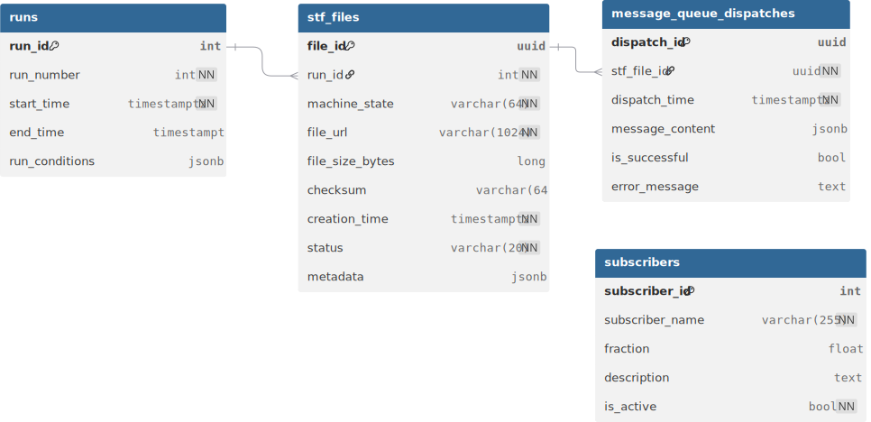

# Database Module

This module provides Django-based database models and operations for the SWF Fast Monitoring Agent, part of the ePIC streaming workflow testbed.

## Overview

The database module tracks Super Time Frame (STF) files, data-taking runs, message queue subscribers, and dispatch operations in the ePIC detector system's data workflow.

## Database Models



## Database Configuration

The module uses PostgreSQL with Django ORM. Configuration is handled through environment variables:

- `POSTGRES_HOST` (default: localhost)
- `POSTGRES_PORT` (default: 5432)
- `POSTGRES_DB` (default: swf_fastmonitoring)
- `POSTGRES_USER` (default: postgres)
- `POSTGRES_PASSWORD` (default: postgres)

## Table Structure

| Table Name | Description                            |
|------------|----------------------------------------|
| `runs` | Data-taking run information            |
| `stf_files` | Super Time Frame file metadata         |
| `subscribers` | Message queue subscriber configuration |
| `message_queue_dispatches` | Dispatch operations to MQ              |

## Django Management

Use standard Django commands for database operations:

```bash
# Apply migrations
python manage.py migrate

# Create new migrations
python manage.py makemigrations

# Database shell
python manage.py dbshell

# Django shell
python manage.py shell
```

## Usage Context

This database module supports the fast monitoring agent's core functions:
1. Tracking STF files through processing lifecycle
2. Managing message queue subscriber configurations
3. Auditing dispatch operations for monitoring and debugging